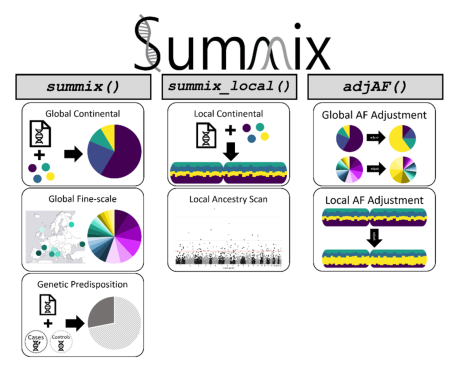
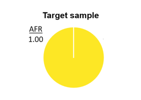
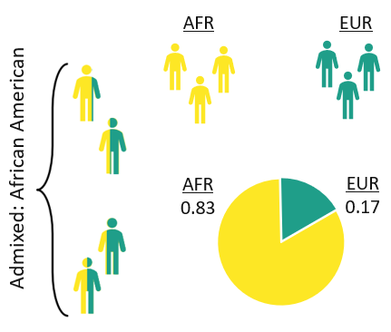
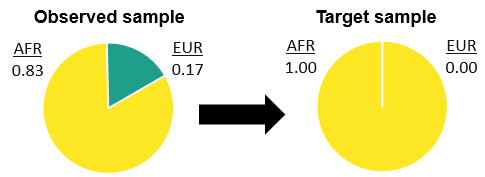
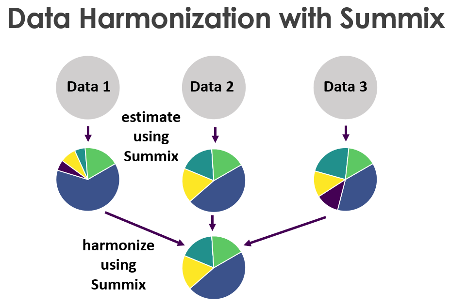

---
output: github_document
---

```{r, include = FALSE}
knitr::opts_chunk$set(
  collapse = TRUE,
  comment = "#>",
  fig.path = "man/figures/README-",
  out.width = "100%"
)
```


Summix2 is a suite of methods to estimate, adjust, and leverage substructure in genetic summary data. This package builds on Summix, a method that estimates and adjusts for substructure in genetic summary that was developed by the Hendricks Research Team at the University of Colorado.

Genetic summary data are broadly accessible and highly useful including for risk prediction, causal inference, fine mapping, and the incorporation of external control information. However, collapsing individual-level data into groups masks intra- and inter-sample heterogeneity, leading to confounding, reduced power, and bias. Unaccounted substructure limits summary data usability, especially for understudied or admixed populations. Summix2 characterizes global and local genetic substructure, adjusts for global and local genetic substructure, and identifies potential regions of selection due to local substructure deviation.  Summix2 increases the robust use of diverse publicly available summary data resulting in improved and more equitable research to address disease etiology and risk prediction.


<br><br>
Find more details about Summix2 in our [**preprint up on BioRxiv**](https://www.biorxiv.org/content/10.1101/2024.01.29.577805v1).

Find more details about Summix in our [**manuscript published in the American Journal of Human Genetics**](https://doi.org/10.1016/j.ajhg.2021.05.016).


<br><br><br>
This document introduces you to Summix2 functions and gives simple examples of how they might applied to genetic summary data.


<br><br>
To jump forward to individual function specifics in Summix2:

[**summix**](#summix) --- [fast forward to example](#a-quick-demo-of-summix)

[**adjAF**](#adjaf) --- [fast forward to example](#a-quick-demo-of-adjaf)

[**summix_local**](#summix_local) --- [fast forward to example](#a-quick-demo-of-summix_local)
<br><br><br>

# Package Installation


To install this package, start R (version "4.3") and run the following commands:

``` r
if (!require("BiocManager", quietly = TRUE))
    install.packages("BiocManager")

BiocManager::install("Summix")
```


<br><br><br>

## Summix2 Functionalities

<center>

</center>

<br>
Summix2 has three primary methods to detect and leverage substructure in genetic summary data. The summix() function is used to detect substructure proportions given AFs for the observed and reference groups, summix_local() is the used to detect local substructure proportions, and adjAF() adjusts AFs for an observed sample to match the substructure proportions of a target sample or individual.


<br><br><br>

## Example of Summix2 Workflow


Before diving into running Summix2 functions and interpreting output, let's start by considering a sample of African (AFR) individuals we are interested in studying. We see in the pie chart below that this sample has 100% African-like genetic substructure.
<br><br>

<center>


</center>

<br>
Lets assume we need access to allele frequencies (AFs) from an appropriate control group (a group with 100% African genetic substructure) to complete the study. We can access publicly available AFs from the [**Genome Aggregation Database (gnomAD)**](https://gnomad.broadinstitute.org/). However, gnomAD only offers AFs across 20,744 African/African American (AFR/AFRAM) individuals. In order for these AFs to be appropriate controls for a study of African individuals, the population substructure within gnomAD's AFR/AFRAM AFs needs to be accounted for. 

<br>
Here is where Summix2 comes in. 


<br>
We begin by using summix() to capture the population substructure in the AFR/AFRAM AFs. We prepare a data frame containing the observed gnomAD AFR/AFRAM AFs, and reference AFs from homogenous groups. Here, we use AFs from homogenous continental-level reference groups- sourced from the Human Genome Diversity Project and 1000 Genomes Project data [**released with gnomAD v3.1.2**](https://gnomad.broadinstitute.org/news/2021-10-gnomad-v3-1-2-minor-release/). 


```{r}
library(Summix)
print(head(ancestryData))
```

<br><br>
Next, we apply summix() to the data frame with the observed group set as gnomAD's AFR/AFRAM AF vector (observed="gnomad_AF_afr") the reference groupings set as all homogenous continental-level reference groups (reference=c("reference_AF_afr", "reference_AF_eas", "reference_AF_eur", "reference_AF_iam", "reference_AF_sas").
```{r}
summix(data = ancestryData,
    reference=c("reference_AF_afr",
        "reference_AF_eas",
        "reference_AF_eur",
        "reference_AF_iam",
        "reference_AF_sas"),
    observed="gnomad_AF_afr")
```
<br>
In this output we see summix() estimates the observed gnomAD AFR/AFRAM AFs to contain approximately 81% African-like, 17% EUR-like, and 1.8% IAM-like mixing proportions. <br>
<br><br>

A visual representation of the above process and output:
<center>

 

</center>

<br><br>

Now that we have captured the substructure within the genetic summary data, we use Summix2's adjAF() to adjust the substructure to match that of the 100% African target sample.
<br>

<center>

 

</center>

When adjusting the genetic substructure, we use only the reference groups with non-zero mixing proportions in the observed and target samples, and ensure the order of mixing proportions in pi.target and pi.observed are in the same order as the reference groups. <br>
We also include the sample sizes for each of the reference groups (N_reference = c(704,741, 47)) and the observed group (N_observed = 20744) to get the effective sample size calculation for the adjusted AF vector. 

```{r}

adjusted_data<-adjAF(data = ancestryData,
     reference = c("reference_AF_afr", "reference_AF_eur", "reference_AF_iam"),
     observed = "gnomad_AF_afr",
     pi.target = c(1, 0, 0),
     pi.observed = c(0.812142, 0.169953, 0.017905),
     adj_method = 'average',
     N_reference = c(704,741, 47),
     N_observed = 20744,
     filter = TRUE)

```
We see that no SNPs were removed from the AF adjusted data frame (only SNPs with AFs that were less than -.005 are removed). Importantly, the effective sample size of the adjusted AF is 17,551 - which can be important for downstream analyses. 

We can take a look at the adjusted AF data frame, and the appended adjusted AF vector (adjustedAF).

```{r}
print(adjusted_data$adjusted.AF[1:5,])


```


<br><br><br>
Using Summix2, we can harmonize the genetic substructure across multiple data sets for secondary analyses.
 


<br><br><br><br><br><br>


## An in depth look at all Summix2 functionalities


<br><br><br>

# summix {#summix}

The *summix()* function estimates mixture proportions of reference groups within genetic summary (allele frequency) data using sequential quadratic programming performed with the [**slsqp() function**](https://www.rdocumentation.org/packages/nloptr/versions/1.2.2.2/topics/slsqp) in the nloptr package.

## *summix()* Input

Mandatory parameters are:

-   **data**: A data frame of the observed and reference group allele frequencies for N genetic variants.

-   **reference**: A character vector of the column names for K reference groups.

-   **observed**: A character value that is the column name for the observed group.

Optional parameters are:

-   **pi.start**: Numeric vector of length K containing the user's initial guess for the reference group proportions. If not specified, this defaults to 1/K where K is the number of reference groups.

-   **goodness.of.fit**: Default value is *TRUE*. If set as *FALSE*, the user will override the default goodness of fit measure and return the raw objective loss from *slsqp()*.

-   **override_removeSmallRef**: Default value is *FALSE*. If set as *TRUE*, the user will override the automatic removal of reference groups with \<1% global proportions - this is not recommended.

## summix() Output

A data frame with the following columns:

-   **goodness.of.fit**: Scaled objective loss from *slsqp()* reflecting the fit of the reference data. Values between 0.5-1.5 are considered moderate fit and should be used with caution. Values greater than 1.5 indicate poor fit, and users should not perform further analyses using Summix2.

-   **iterations**: The number of iterations for the SLSQP algorithm before best-fit reference group proportion estimates are found.

-   **time**: The time in seconds before best-fit reference group mixture proportion estimations are found by the SLSQP algorithm.

-   **filtered**: The number of genetic variants not used in the reference group mixture proportion estimation due to missing values.

-   **K columns** of mixture proportions of reference groups input into the function.

<br><br><br>

## adjAF {#adjaf}

The *adjAF()* function adjusts allele frequencies to match reference group substructure mixture proportions in a given target group or individual.

## *adjAF()* Input

Mandatory parameters are:

-   **data**: A data frame containing the unadjusted allele frequency for the observed group and K reference group allele frequencies for N genetic variants.

-   **reference**: A character vector of the column names for K reference groups.

-   **observed**: A character value that is the column name for the observed group.

-   **pi.target**: A numeric vector of the mixture proportions for K reference groups in the target group or individual.

-   **pi.observed**: A numeric vector of the mixture proportions for K reference groups in the observed group.

-   **N_reference**: A numeric vector of the sample sizes for each of the K reference groups that is in the same order as the reference parameter.

-   **N_observed**: A numeric value of the sample size of the observed group.

Optional parameters are:

-   **adj_method**: User choice of method for the allele frequency adjustment; options *"average"* and *"effective"* are available. Defaults to *"average"*.

-   **filter**: Sets adjusted allele frequencies equal to 1 if \> 1, to 0 if \> -.005 and \< 0, and removes adjusted allele frequencies \< -.005. Default is *TRUE*.

## adjAF() Output

A data frame with the following columns:

-   **pi**: A table of input reference groups, pi.observed, and pi.target.

-   **observed.data**: The name of the data column for the observed group from which the adjusted allele frequencies are estimated.

-   **Nsnps**: The number of SNPs for which adjusted AF is estimated.

-   **adjusted.AF**: A data frame of original data with an appended column of adjusted allele frequencies.

-   **effective.sample.size**: The sample size of individuals effectively represented by the adjusted allele frequencies.

<br><br><br>

# summix_local {#summix_local}

The *summix_local()* function estimates local ancestry mixture proportions in genetic summary data using the same *slspq()* functionality as *summix()*. *summix_local()* also performs a selection scan (optional) that identifies regions of selection along the given chromosome.

## *summix_local()* Input

Mandatory parameters are:

-   **data**: A data frame of the observed group and reference group allele frequencies for N genetic variants on a single chromosome. Must contain a column specifying the genetic variant positions.

-   **reference**: A character vector of the column names for K reference groups.

-   **observed**: A character value that is the column name for the observed group.

-   **position_col**: A character value that is the column name for the genetic variants positions. Default is *"POS"*.

-   **maxStepSize**: A numeric value that defines the maximum gap in base pairs between two consecutive genetic variants within a given window. Default is 1000.

Optional parameters are:

-   **algorithm**: User choice of algorithm to define local ancestry blocks; options *"fastcatch"* and *"windows"* are available. *"windows"* uses a fixed window in a sliding windows algorithm. *"fastcatch"* allows dynamic window sizes. The *"fastcatch"* algorithm is recommended- though it is computationally slower. Default is *"fastcatch"*.

-   **type**: User choice of how to define window size; options *"variants"* and *"bp"* are available where *"variants"* defines window size as the number of variants in a given window and *"bp"* defines window size as the number of base pairs in a given window. Default is *"variants"*.

-   **override_fit**: Default is *FALSE*. If set as *TRUE*, the user will override the auto-stop of *summix_local()* that occurs if the global goodness of fit value is greater than 1.5 (indicating a poor fit of the reference data to the observed data).

-   **override_removeSmallAnc**: Default is *FALSE*. If set as *TRUE*, the user will override the automatic removal of reference ancestries with \<2% global proportions -- this is not recommended.

-   **selection_scan**: User option to perform a selection scan on the given chromosome. Default is *FALSE*. If set as *TRUE*, a test statistic will be calculated for each local ancestry block. Note: the user can expect extended computation time if this option is set as *TRUE*.

Conditional parameters are:

If **algorithm** = *"windows"*:

-   **windowOverlap**: A numeric value that defines the number of variants or the number of base pairs that overlap between the given sliding windows. Default is 200.

If **algorithm** = *"fastcatch"*:

-   **diffThreshold**: A numeric value that defines the percent difference threshold to mark the end of a local ancestry block. Default is 0.02.

If **type** = *"variants"*:

-   **maxVariants**: A numeric value that specifies the maximum number of genetic variants allowed to define a given window.

If **type** = *"bp"*:

-   **maxWindowSize**: A numeric value that defines the maximum allowed window size by the number of base pairs in a given window.

If **algorithm** = *"fastcatch"* and **type** = *"variants"*:

-   **minVariants**: A numeric value that specifies the minimum number of genetic variants allowed to define a given window.

If **algorithm** = *"fastcatch"* and **type** = *"bp"*:

-   **minWindowSize**: A numeric value that specifies the minimum number of base pairs allowed to define a given window.

If **selection_scan** = *TRUE*:

-   **NSimRef**: A numeric vector of the sample sizes for each of the K reference groups that is in the same order as the reference parameter. This is used in a simulation framework that calculates within local ancestry block standard error.

## summix_local() Output

A data frame with a row for each local ancestry block and the following columns:

-   **goodness.of.fit**: Scaled objective loss from *slsqp()* reflecting the fit of the reference data. Values between 0.5-1.5 are considered moderate fit and should be used with caution. Values greater than 1.5 indicate poor fit, and users should not perform further analyses using Summix2.

-   **iterations**: The number of iterations for the SLSQP algorithm before best-fit reference group mixture proportion estimations are found.

-   **time**: The time in seconds before best-fit reference group mixture proportion estimations are found by the SLSQP algorithm.

-   **filtered**: The number of genetic variants not used in the reference group mixture proportion estimation due to missing values.

-   **K columns** of mixture proportions of reference ancestry in the given local ancestry block.

-   **nSNPs**: The number of genetic variants in the given local ancestry block.

Additional Output if **selection_scan** = *TRUE*:

-   **K columns** of local ancestry test statistics for each reference ancestry in the given local ancestry block.

-   **K columns** of p-values for each reference ancestry in the given local ancestry block. P-values calculated using the Student's t-distribution with degrees of freedom=(nSNPs in the block)-1. <br><br><br>

# Examples using toy data in the Summix package

For quick runs of all demos, we suggest using the data saved within the Summix library called ancestryData.

## A quick demo of summix() {#a-quick-demo-of-summix}

The commands:

```{r summix example}
library(Summix)

# load the data
data("ancestryData")

# Estimate 5 reference ancestry proportion values for the gnomAD African/African American group
# using a starting guess of .2 for each ancestry proportion.
summix(data = ancestryData,
    reference=c("reference_AF_afr",
        "reference_AF_eas",
        "reference_AF_eur",
        "reference_AF_iam",
        "reference_AF_sas"),
    observed="gnomad_AF_afr",
    pi.start = c(.2, .2, .2, .2, .2),
    goodness.of.fit=TRUE)


```

<br><br><br><br>

## A quick demo of adjAF() {#a-quick-demo-of-adjaf}

The commands:

```{r adjAF example}
library(Summix)

# load the data
data("ancestryData")


adjusted_data<-adjAF(data = ancestryData,
     reference = c("reference_AF_afr", "reference_AF_eur"),
     observed = "gnomad_AF_afr",
     pi.target = c(1, 0),
     pi.observed = c(.85, .15),
     adj_method = 'average',
     N_reference = c(704,741),
     N_observed = 20744,
     filter = TRUE)
print(adjusted_data$adjusted.AF[1:5,])


```

<br><br><br><br>

## A quick demo of summix_local() {#a-quick-demo-of-summix_local}

The commands:

```{r summix_local example}
library(Summix)

# load the data
# data("ancestryData")
# 
# results <- summix_local(data = ancestryData,
#                         reference = c("reference_AF_afr",
#                                       "reference_AF_eas",
#                                       "reference_AF_eur",
#                                       "reference_AF_iam",
#                                       "reference_AF_sas"),
#                         NSimRef = c(704,787,741,47,545),
#                         observed="gnomad_AF_afr",
#                         goodness.of.fit = T,
#                         type = "variants",
#                         algorithm = "fastcatch",
#                         minVariants = 150,
#                         maxVariants = 250,
#                         maxStepSize = 1000,
#                         diffThreshold = .02,
#                         override_fit = F,
#                         override_removeSmallAnc = TRUE,
#                         selection_scan = F,
#                         position_col = "POS")
# 
# print(results$results)

```

<br><br>


